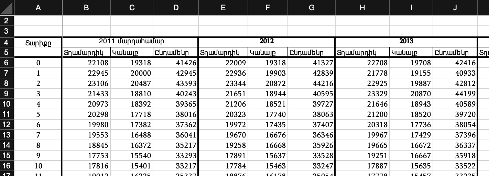

# Armenian Demographical Analytics
The following project is dedicated to the Armenian population. The [dataset](https://armstat.am/en/?nid=209) is from the [official site](https://armstat.am).

Հետևյալ նախագիծը նվիրված է վերլուծության Հայաստանի բնակչության։ [Տվյալները](https://armstat.am/en/?nid=209) ստացված են [պաշտոնական կայքից](https://armstat.am)։
## Prerequisite | Նախադրյալներ
* Matplotlib
* Numpy
* Pandas

## Preparing data | Տվյալների պատրաստում
The database is in file with `xlsx` format, which has the following structure: 

Տվյալների բազան ներկայացված է `xlsx` Ֆայլոն, որը ունի հետևյալ ձև՝

This table contains the quantity of males and females of a certain age in each year. With this information, new data is obtained and presented, which provides a much clearer understanding and allows to rate the situation in different years.

Initially, the downloaded data must be prepared in such a way that further work is possible.

Այս աղուսյակը պարունակում է տղամարդկանց և կանանց քանակը որոշ տարիքի ամեն տարի։ Այդ ինֆորմացիայի հիմքի շնորհիվ ստացված էն և ներկայացված էն նոր տվյալներ, որոնք շատ ավելի պարզ հասկացողություն են ապահովում և թույլ են տալիս գնահատել դրույքը տարբեր տարիներին։

Սկզբից ներբեռնած տվյալները պիտի ձևափոխվեն այնպես, որ հետագա աշխատանքը հնարավոր լինի։

## Conclusions | Եզրակացություններ
The obtained result allows to make some conclusions and assumptions.

Unfortunately, over 10 years, the young generation (approximately 15-25 years old) has decreased by almost **80,000** people. The result shows that there are two noticeable gaps in the graph of the difference between 2021 and 2011: the young generation (ages 15-25) and the older generation (ages 45-55).

Presumably, 2020 war played a big role in the difference for young men. However, it also appears that the difference between women is greater. Considering that there is also a gap for older generation, it is probably connected with the fact that families left Armenia after the start of the war. There are more young people (30-45 years old) in 2021 presumably for the following reasons, which are more common in people of that age:

* military service (inability to leave)
* desire to stay in Armenia
* financial inability

By the way, as you can see from the same graph, 60+ people chose to stay in Armenia, because usually these people do not want to leave their homes, and those who do, often do not have the physical opportunity.
Thus, the number of young people is decreasing, which extremely slows down the country's development, but excluding external factors, Armenia has a good trend.

Ստացված արդյունքը թույլ է տալիս անել որոշ եզրակացություններ և ենթադրություններ։

Ցավոք, 10 տարվա ընթացքում ջահել սերունդը (մոտավորապես 15-25 տարեկան) գրեթե **80,000** մարդ քիչացել է։ Արդյունքը ցույց է տալիս, որ 2021 ու 2011 թվականների տարբերության գրաֆիկի մեջ երկու նկատելի փոս են գտնվում՝ ջահել սերումդի (15-25 տարեկան) և մեծ սերունդի (45-55 տարեկան):

Ենթադրաբար,  ջահելության տղամարդկանց տարբերության մեջ մեծ դեր է խաղացել 2020 թ. պատերազմը։ Սակայն նաև երևում է, որ կանանց տարբերությունը ավելի մեծ է։ Հաշվի առնելով, որ այդ փոսը կա մեծ սերունդի մոտ, դա ենթադրաբար կապված է նրա հետ, որ պատերազմ սկսվելուց հետո ընտանիքները լքել են Հայաստանը։ Ավելի ջահել մարդիկ (30-45 տարեկան) ավելի շատ են 2021 թ. ենթադրաբար հետևյալ պատճառներով, որոնք ավելի հաճախ ունենում են հենց այդ տարիքի մարդիկ՝

* ռազմական դրույք (լքելու անկարողությոյն)
* ցանկություն մնալ Հայաստանում
* ֆինանսական անկարողություն

Ի դեպ, ոնց երևում է նույն գրաֆիկից, 60+ մարդիկ նախընտրել են մնալ Հայաստանում, քանի որ սովորաբար այս մարդիկ չունեն ցանկություն լքել իրենց տունը, իսկ ով ունի՝ հաճախ չի ունենում ֆիզիկական հնարավորություն։
Այսպիսով, ջահելության քանակը քչանում է, ինչը շատ ավելի դանդաղեցնում է երկրի զարգացումը, սակայն արտաքին ֆակտորները չհաշված, Հայաստանը ունի լավ տենդենց։

